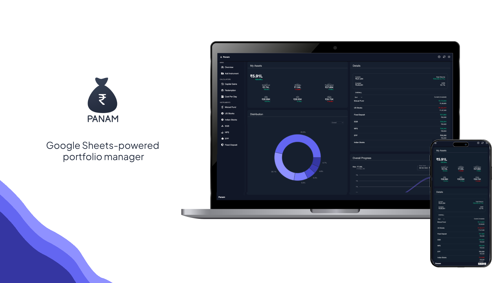

<div align="center">

# Panam


</div>

# Table of Contents

- [About](#about)
- [Demo](#demo)
- [Features](#features)
- [Getting Started](#getting-started)
   - [Prerequisites](#prerequisites)
   - [Installation](#installation)
   - [Getting Started with Development](#getting-started-with-development)

## About
Welcome to Panam! This web app built using Google Apps Script uses Google Sheets to help you manage and track your investments. It allows for easy visualization, performance analysis, and easy management of your investment portfolio, all while ensuring your data remains private and secure.

## Demo
A demo of the web app can be found at: https://panam-demo.akshayxml.com

## Features

- **Fully Customizable:** Easily add, update, or remove any type of investments in the Google Sheet.
- **Performance Analysis:** Calculate gains, losses, XIRR and other key metrics to analyze the performance of your investments.
- **Enhanced Privacy:** As the application is integrated with Google Sheets, it uses the user's Google account for authentication. This ensures that all data remains private and accessible only to the user, leveraging Google's robust security measures.
- **Historical Graph:** See how your portfolio has grown over time.
- **Capital Gains Calculator:** Check out how much capital gains tax will be applied on each of your investment.

## Getting Started

### Prerequisites

- A Google account
- Basic understanding of Google Sheets
- Familiarity with JavaScript and Google Apps Script is beneficial but not required

### Installation
1. Make a Copy of the Spreadsheet:
   - Open the original spreadsheet at the following link: \
    [Google Spreadsheet](https://docs.google.com/spreadsheets/d/13P0q0RMEsY3uuaUJ1Il1DsnyIt4vcSZ_A-_HEHPVLD0/edit?usp=sharing)
   - Make a copy of the spreadsheet to your own Google Drive.
2. Set Up the Cron:
   - Go to `Extensions` > `Apps Script`. 
   - In the Apps Script editor, select `setupDailyCronTrigger` from the function dropdown (if not already selected). 
   - Click on the Run button to execute the script. 
   - When prompted with the Authorization required dialog box, click on Review Permissions. 
   - Choose your Google account and grant the necessary permissions.
3. Deploy the Web App:
   - Once the script execution is complete, click on `Deploy` > `New Deployment`. 
   - Set `Execute as` to 'Me' and `Who has access` to 'Only Myself' to ensure only you can access the web app. 
   - Click on Deploy. 
   - Click on Authorize Access and grant the necessary permissions.
4. Start Using the Web App:
   - Once deployment is complete, open the web app URL to begin tracking your investments!

### Getting Started with Development

1. **Clone the Repository:**  
   Clone the project repository to your local machine.
   ```bash
   git clone https://github.com/akshayxml/panam
2. **Install clasp:**  
   Install clasp for command-line development of Google Apps Script.
   ```bash
   npm install -g @google/clasp
3. **Run `clasp login`**  
4. **Create `.clasp.json`:**

   In the project root, create a `.clasp.json` file with the following content:
   ```json
   {
     "scriptId": "your-script-id",
     "rootDir": "<project-dir>/dist"
   }
   ```
    scriptId: Complete the steps mentioned in the [Installation](#installation) section. Open the Apps Script Editor (`Extensions` > `Apps Script` from the spreadsheet). You can find the ID in Apps Script Editor url: `https://script.google.com/u/0/home/projects/<ID>/edit`. \
    rootDir: The directory containing the project files, typically set to dist. 

   Replace your-script-id with your specific script ID and <project-dir> with your project directory name.
